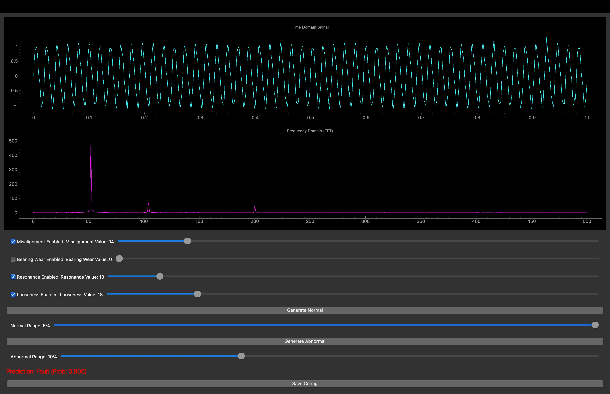

# Fault Simulation with Model Prediction

This application is a fault simulation tool integrated with LightGBM model prediction. It generates synthetic signals to simulate different fault modes, predicts the fault status using a trained LightGBM model, and visualizes the results.

## Features

- Simulate `Normal` and `Fault` signals.
- Adjust fault modes (`Misalignment`, `Bearing Wear`, `Resonance`, `Looseness`) using sliders and enable/disable switches.
- Predict fault status using a pre-trained LightGBM model (`lightgbm_fault_model.txt`).
- Display predictions and confidence levels.
- Save simulated data to a CSV file for further analysis.
- Configurable signal parameters for flexibility.

## Requirements

- Python 3.11
- Required Python packages listed in `requirements.txt`

## Installation

1. Clone the repository:

```bash
git clone https://github.com/kino-6/fault-simulator.git
cd fault-simulator
```

2. Create a virtual environment:

```bash
python3.11 -m venv venv

# on linux or mac
source venv/bin/activate

# on windows
# venv\Scripts\activate

# upgrade pip
pip install --upgrade pip

# install modules
pip install -r requirements.txt
```

3. Run app:

```bash
python app.py
```

## push Generate Normal or Abnormal




## train model

- run `train.ipynb`
  - use `assets/datasets/simulated_dataset.zip`
  - generated by `assets/datasets/generate_data.py`
